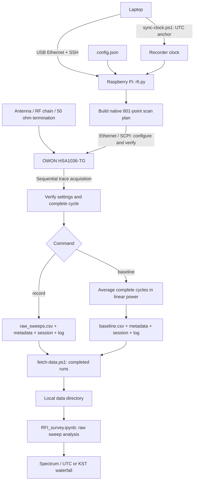
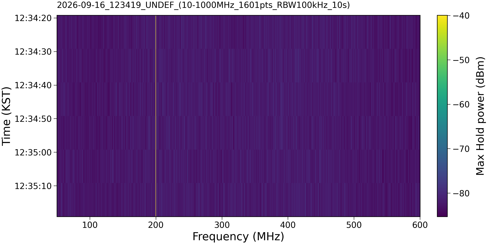

# ObsCAL-RFI Monitor

OWON HSA1036-TG 스펙트럼 분석기와 Raspberry Pi로 RFI environment를 monitoring하기 위한 도구입니다. 현장에서는 RPi가 측정과 저장을 담당하고, 노트북은 SSH 설정·데이터 전송·분석에 사용합니다.

현재 지원하는 구성은 **HSA1036-TG / firmware V3.0.2.0**, 64-bit Raspberry RPi OS, Python 3입니다. 모델·firmware·serial number와 실제 설정 readback을 확인한 뒤 기록합니다.

## 주요 기능

- 주파수 범위, 최대 bin 간격, RBW/VBW, reference level, attenuation, 내부 preamp 설정.
- Native 801-point sweep을 여러 구간으로 나누어 전체 대역 기록. 선택한 protection band은 하나의 sweep에 유지.
- UTC timestamp가 포함된 단일 `raw_sweeps.csv` 저장과 설정·scan plan metadata 기록.
- 측정 시간 지정, SSH 종료 후 background 실행, 상태 확인과 정상 종료.
- 50 Ω termination을 이용한 별도 baseline spectrum 측정.
- 완료된 run 중 로컬에 없는 파일만 다운로드 (SHA-256 verification)
- Notebook에서 time-window별 Max Hold·linear-power average, UTC/KST waterfall.

## 동작 방식



일반 관측은 `record`, termination reference spectrum 측정은 `baseline` 명령으로 실행합니다.

`record`는 전체 대역을 구성하는 sweep들을 순서대로 취득하고, 완성된 cycle 하나를 CSV 한 행으로 저장합니다. 취득 가능한 속도로 반복하며, `window_seconds`는 기록 주기나 SA의 연속 적분 시간을 지정하지 않습니다. 분석할 때 Notebook의 `WINDOW_SECONDS`로 시간 창을 선택합니다.

SA에는 Positive Peak detector, WRITE trace, single sweep, 자동 sweep time, dBm 단위를 적용합니다. RBW/VBW와 attenuation은 수동값을 사용하고 EMI filter와 TG는 OFF로 설정합니다. 

## Config 예제

다음은 10–1000 MHz 전체를 기록하는 `config.json` 예제입니다. `host`, `expected_serial`, `site`를 자신의 장비와 관측 장소에 맞게 바꿉니다. `expected_serial`은 SA의 System 화면에서 확인할 수 있습니다.

```json
{
  "host": "192.168.40.230",
  "port": 1015,
  "expected_serial": "YOUR_SA_SERIAL",
  "start_hz": 10000000,
  "stop_hz": 1000000000,
  "bin_size_hz": 1000000,
  "protection_region_hz": [50000000, 400000000],
  "rbw_hz": 100000,
  "vbw_hz": 100000,
  "reference_dbm": -20,
  "attenuation_db": 0,
  "preamp": 0,
  "window_seconds": 10,
  "sweep_wait_factor": 2.0,
  "sweep_wait_margin_seconds": 0.3,
  "stable_check_seconds": 0.1,
  "min_free_mb": 512,
  "output_dir": "data",
  "site": "MY_SITE"
}
```

`bin_size_hz`는 출력 주파수 좌표의 최대 간격이며, 실제 주파수 분해능을 정하는 RBW와 구분합니다. 위 예제는 `npoints`를 생략했으므로 다음과 같이 자동 계획됩니다.

| 설정 | 실제 sweep | 최종 출력 |
| --- | --- | --- |
| 위 예제: 자동 분할 | 10–505 / 505–1000 MHz, 각각 801점 | 1601점, 0.61875 MHz 간격 |
| `"npoints": 991` 추가 | 10–810 / 200–1000 MHz, 각각 801점 | 991점, 정확히 1 MHz 간격 |

겹치는 주파수 좌표는 필요한 구간만 남겨 연결합니다. 값의 보간은 하지 않습니다. `protection_region_hz`는 지정 대역이 한 sweep 안에 들어가게 하며, 예제의 50–400 MHz protection region에서는 bin 간격을 437.5 kHz보다 작게 요구할 수 없습니다. 더 촘촘한 격자는 보호 대역을 줄이거나 `null`로 해제해야 합니다.

`preamp`는 SA 내부 preamp이며 정수 `0`은 OFF, `1`은 ON입니다. `polarization`, `rf_chain`, `notes`를 추가하면 관측 조건을 metadata에 함께 남길 수 있습니다. `output_dir`가 상대 경로이면 `rfi.py`가 있는 폴더를 기준으로 저장합니다.

## 실행

RPi에서 기록에 필요한 외부 Python 패키지는 `numpy`입니다. 로컬 분석 환경은 저장소 루트에서 설치합니다.

```bash
python -m pip install -r requirements.txt
```

아래 RPi 명령은 `source/`의 실행 모듈들과 사용할 `config.json`이 `~/owon-rfi/`에 배치되어 있고, SA Ethernet 및 SSH 연결이 준비된 구성을 기준으로 합니다. 기존 운영 설치에서는 이 디렉터리를 사용합니다.

먼저 Windows PowerShell에서 저장소 루트를 열고 기록용 UTC clock anchor를 설정합니다. `sync-clock.ps1`의 `Target`, `Key`와 Pi 경로는 자신의 배포 환경에 맞춰 사용합니다. RPi 재부팅 후에는 다시 실행하며, anchor의 유효기간은 7일입니다.

```powershell
.\tools\sync-clock.ps1
```

RPi에서 설정·scan plan을 미리 확인하고, 10분 또는 24시간 기록합니다.

```bash
cd ~/owon-rfi
python3 rfi.py record --config config.json --seconds 600 --summary-only
python3 -u rfi.py record --config config.json --seconds 600

# SSH 연결이 끊어진 후에도 24시간 기록
nohup python3 -u rfi.py record --config config.json --hours 24 >> record.log 2>&1 < /dev/null &
echo "Started PID: $!"
```

Foreground 실행은 `Ctrl+C`로 종료합니다. Background 실행은 `status`의 PID를 확인한 뒤 `kill -TERM PID`로 정상 종료할 수 있습니다.

```bash
python3 rfi.py status
tail -f record.log
```

SSH 종료 후에도 기록하려면 RPi 전원이 유지되어야 합니다. USB가 유일한 전원이라면 케이블을 분리할 때 RPi도 꺼집니다. 기록 시간은 `--seconds` 또는 `--hours`로 지정하며, 둘 다 생략하면 24시간입니다. 종료 시 진행 중인 cycle 때문에 지정 시간보다 조금 길어질 수 있습니다.

50 Ω 종단기를 SA 입력에 연결한 뒤, 별도 baseline을 약 60초 동안 취득할 수 있습니다.

```bash
python3 -u rfi.py baseline --config config.json --seconds 60
```

Baseline은 각 cycle의 dBm 값을 mW로 변환해 평균한 뒤 dBm으로 저장합니다. 평균 spectrum 하나만 저장하며 recorder가 관측 데이터에서 자동으로 subtraction하지는 않습니다. 비교할 관측과 RBW/VBW, attenuation, preamp 조건을 맞춰 사용합니다.

## 저장 파일과 로컬 분석

각 run은 기록 시작 시각의 UTC 폴더에 저장됩니다.

```text
data/YYYYMMDDTHHMMSSZ/
  raw_sweeps.csv         # record: timestamp + 주파수별 dBm
  metadata_sweeps.json   # 실제 SA 설정, 주파수축, scan plan, clock
  session.json          # 시작/종료 정보, 완료 상태, config
  events.log            # 구간별 취득 시각과 실행 로그
```

`baseline` run에는 `raw_sweeps.csv`와 `metadata_sweeps.json` 대신 `baseline.csv`와 `metadata_baseline.json`이 저장됩니다. `baseline.csv`는 `frequency_hz, mean_power_dbm` 두 열을 갖습니다.

`raw_sweeps.csv`의 앞 세 열은 `request_utc_ns`, `read_complete_utc_ns`, `pi_system_request_ns`입니다. 뒤쪽 열 이름에는 실제 주파수가 `<frequency>_Hz` 형식으로 저장됩니다. 첫 두 timestamp는 clock anchor로 계산한 UTC이고, 세 번째는 RPi OS 시각을 확인하기 위한 값입니다.

Windows PowerShell에서 완료된 run을 내려받습니다. `fetch-data.ps1`의 대상 RPi, SSH key, 로컬 저장 경로를 자신의 환경에 맞춥니다.

```powershell
.\tools\fetch-data.ps1 -ListOnly
.\tools\fetch-data.ps1

# 특정 run만 다운로드: 실제 RPi 폴더명으로 바꾸기
.\tools\fetch-data.ps1 -Run '20260916T033419Z'
```

로컬 데이터는 `YYYY-MM-DD_site/Pi원본run명/` 구조로 정리됩니다. 날짜는 KST 기준이며 UTC run 폴더명은 유지합니다. 이미 있는 파일은 내용이 일치하면 건너뛰고, 다른 내용이면 덮어쓰지 않고 중단합니다.

```bash
python -m jupyterlab notebook/RFI_survey.ipynb
```

Notebook에서 `PROJECT_DIR`, `DATA_ROOT`, `INPUTS`를 지정합니다. `INPUTS`에는 관측 run 폴더 또는 `raw_sweeps.csv`를 선택하고, 같은 폴더에 `session.json`과 `metadata_sweeps.json`을 함께 둡니다. 

- `WINDOW_SECONDS`
- `STATISTIC` (`max_dbm` 또는 `mean_peak_power_dbm`)
- `TIME_ZONE` (`UTC` 또는 `KST`)
- `FOCUS_MHZ`

## 출력 예시

200 MHz, 약 −40 dBm의 톤 입력을 기록한 예시입니다. 10–1000 MHz를 1601점으로 구성했으며 RBW는 100 kHz입니다.
같은 기록의 50–600 MHz 구간을 10초 window별 Max Hold로 표시한 waterfall입니다. (출력값은 SA 입력단의 Positive Peak 측정값입니다.
) 세로축은 시간 (KST)를 나타내며, 아래로 증가합니다.



## 파일 구성

| 경로 | 역할 |
| --- | --- |
| `source/rfi.py` | SA 설정, record/baseline 취득, 상태·metadata 저장 |
| `source/owon.py` | Ethernet SCPI 통신 및 binary trace 읽기 |
| `source/frequency_plan.py` | 주파수 범위와 bin 조건에 맞춘 scan plan |
| `source/clock_anchor.py` | 오프라인 기록용 UTC 기준 |
| `source/survey_analysis.py`, `source/waterfall.py` | CSV 읽기, 시간 통계, plotting |
| `notebook/RFI_survey.ipynb` | 로컬 분석과 그림 출력 |
| `tools/` | Clock 설정, 데이터 다운로드·검증 |
| `assets/readme/` | 저장소에 포함하는 출력 예시 이미지 |

전체 옵션과 현장 운용 명령은 [USAGE.txt](USAGE.txt)를 참고하세요.
